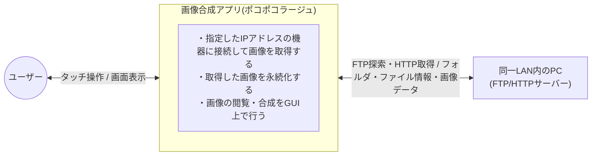

# 方式設計書

システムを「どう作るか」を決める。ここで決めた内容は、[要件定義](../requirements.md)の制約条件を満たすための手段。個別の判断の背景・代替案は[ADR](../decisions/)側に書き、ここには最終的な設計内容をまとめる。

## システムのふるまい

外部(ユーザー、同一LAN内のPC)とアプリの境界を示す。

## システム構成図

コンポーネント同士がどう繋がるかを図示する。(例: NetX Duo・FileX・GUIXの関係、データの流れ)

## 採用技術・ライブラリ

要件定義の制約条件で決まっているもの以外に、方式設計で選定したものがあれば記載する。

| 技術/ライブラリ | 用途 | 選定理由(詳細はADR参照) |
|---|---|---|
| NetX Duo FTPクライアント | 指定IPアドレスへの接続・フォルダの探索 | [0002](../decisions/0002-ftp-discovery-http-transfer.md) |
| NetX Duo HTTPクライアント | ファイルの実転送 | [0002](../decisions/0002-ftp-discovery-http-transfer.md) |
| libpng + zlib | 合成画像のPNGエンコード(保存) | [0003](../decisions/0003-libpng-for-png-encoding.md) |

## コンポーネント構成

システムを構成するモジュール・スレッドの一覧と、それぞれの責務。

| スレッド | 責務 | 備考 |
|---|---|---|
| GUIXシステムスレッド | ウィジェットツリーの処理、描画、イベントハンドラの呼び出し | `gx_system_start()`がGUIX内部で自動生成。自分で作らない |
| GUIX入力イベントスレッド | タッチ(Win32ではマウス)入力を拾い、GX_EVENTに変換してシステムスレッドに渡す | GUIXが自動生成。実機ではタッチパネルドライバに相当 |
| FTP探索スレッド | 指定IPアドレスへの接続、フォルダの探索(NetX Duo FTPクライアント) | 自分で作るスレッド。普段はキューで指示待ち |
| HTTP転送スレッド | ファイルの実転送(NetX Duo HTTPクライアント) | 自分で作るスレッド。普段はキューで指示待ち |
| データ管理スレッド | FileXでの永続化、編集中データ(移動した位置など)の保持 | 自分で作るスレッド。普段はキューで指示待ち |

実質、自分で設計・実装するスレッドはFTP探索・HTTP転送・データ管理の3本(GUIXの2本は自動生成)。

**スレッド間の連携方法**

- **画面描画スレッド → ワーカースレッド(指示を出す方向)**: `TX_QUEUE`を使う。イベントハンドラ(GUIXシステムスレッドの中で呼ばれる)が、対象スレッド宛てのキューに指示(コマンド+パラメータ)を送るだけで、すぐ処理を返す。実際の重い処理はワーカースレッド側で行う
- **ワーカースレッド → 画面描画スレッド(結果を返す方向)**: GUIXのウィジェットをGUIXスレッド以外から直接操作するのは避け、`TX_MUTEX`で保護した共有データにワーカースレッドが結果を書き込み、画面描画スレッド側のタイマー(`GX_EVENT_TIMER`)が定期的にポーリングして画面に反映する

## データフロー・通信方式

コンポーネント間でどんなデータが、どういう経路・タイミングでやり取りされるか。

**画像取得のユースケース**

- メインの想定利用シーン: 同一LAN内の別PC(Windows、IISでFTPサイト・既定のWebサイトを有効化済み)に対して通信する
- 自分自身(localhost)への通信でも動作する(単体での動作確認用)

**画像取得のパイプライン(FTPで探索、HTTPで転送)**

1. FTPで機器に接続し、フォルダを一覧・移動してファイルを探す(LIST、CWD)
2. 見つけたファイルのパスから、対応するHTTP URLを組み立てる(同じホスト・同じ相対パスで公開されている前提)
3. HTTPでそのURLに対してGETし、ファイル本体を取得する

詳細な検討経緯は[ADR-0002](../decisions/0002-ftp-discovery-http-transfer.md)を参照。

## データ永続化方針

**保存対象**

- ダウンロードした画像(FR3・FR4)
- 合成して保存した画像(FR9)

両方とも同じ場所(同一のファイル一覧)に混在して保存する。フォルダ分けするかどうかは今回は規定しない。

**ファイル名の付け方**

- ダウンロード画像: 取得元のファイル名をそのまま使う
- 合成画像: D03(名前入力ダイアログ)で入力した名前を使う。入力欄には初期値として、選択した1枚目の画像のファイル名がプリセットされる(そのまま使うことも、書き換えることもできる)

## エラーハンドリング方針

**共通のUIパターン**

エラーは種類によらず、D02・D04と同じ「メッセージ+OKボタンのみのパネル」で統一する。自動では消さず、ユーザーがOKを押すまで表示し続ける。技術的な詳細(エラーコード等)は表示せず、何が起きたかが分かる簡潔な一言に留める。

**通信エラー(FTP探索・HTTP転送)**

- 対象: 指定したIPアドレスに接続できない、接続タイムアウト、転送中の切断など
- 自動リトライはしない。失敗をパネルで伝え、やり直したい場合はユーザーが操作をもう一度行う(シンプルさを優先)

**ストレージエラー(FileX)**

- 対象: ディスク容量不足、書き込み失敗など
- **既存データを壊さないことを優先する。** 上書き保存(D05)の場合、新しい内容をそのまま元ファイルに書き込むのではなく、書き込みが完了してから置き換える(失敗時は元のファイルが残る)
- 保存自体が失敗した場合は、他のエラーと同様にパネルで通知する

**入力エラー**

D04(エラーパネル)で扱う内容(空欄・禁止文字・同名重複)は、[入出力仕様](functional.md#入出力仕様)を参照。

**ログ**

デバッグのため、`printf`の出力をログファイルに書き出す(POC(win_rtos_poc.exe)と同じ方式)。エラー発生時も、パネルに出す簡潔なメッセージとは別に、原因の詳細をログには残す。

## 関連ADR

- [0001. プラットフォームにWindows(Win32シミュレータ)を採用する](../decisions/0001-windows-platform.md)
- [0002. 画像取得は「FTPで探索、HTTPで転送」の二段構成にする](../decisions/0002-ftp-discovery-http-transfer.md)
