# 機能設計書

システムが「何をするか」を決める。[要件定義](../requirements.md)の機能要件(FR)を、実際の画面・操作に落とし込む。

## 画面一覧

| 画面ID | 画面名 | 概要 |
|---|---|---|
| S01 | メイン画面 | アプリ起動時に表示される最初の画面 |
| S02 | 画像取得画面 | 指定したIPアドレスの機器にFTP接続し、フォルダを掘ってファイルを取得する |
| S03 | ファイル一覧画面 | 保存済み画像の一覧を表示し、ビューア/コラージュのモードを選ぶ |
| S04 | ビューア画面 | 選択した画像を1枚表示する |
| S05 | コラージュ画面 | 選択した画像を横並びで合成する |

## 画面遷移図

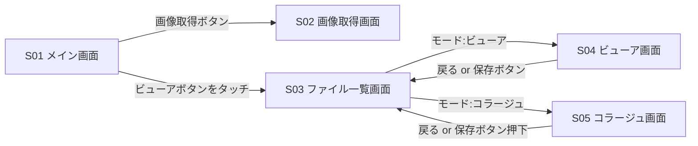

(S02で「取得開始」を押した後は画面遷移せず、D02(取得結果パネル)を表示してS02の状態に戻る。詳細は[ダイアログ一覧](#ダイアログ一覧)を参照)

## ダイアログ一覧

画面本体ではなく、画面の上に重ねて表示するミニダイアログ。

| ダイアログID | 名称 | 概要 |
|---|---|---|
| D01 | 編集ツールバー | 画像編集の各機能を選ぶツールバー |
| D02 | 取得結果パネル | 画像取得の成功/失敗を知らせるダイアログ |
| D03 | 名前入力ダイアログ | 名前を入力するダイアログ(コラージュ保存時、ビューアの別名保存時に使用) |
| D04 | エラーパネル | 入力エラー(空欄・禁止文字・同名重複)を知らせるダイアログ |
| D05 | 保存方法選択ダイアログ | ビューア画面で「上書き保存」「別名で保存」を選ぶダイアログ |
| D06 | 接続先入力ダイアログ | 画像取得画面で、接続先のIPアドレスを入力するダイアログ |

### D01. 編集ツールバー

**レイアウト**

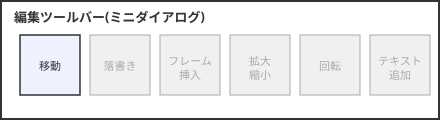

**要素**

| 要素 | 種類 | 説明 |
|---|---|---|
| 移動 | アイコンボタン | 有効。画像の表示位置を移動する |
| 落書き | アイコンボタン | 現時点では箱のみ配置し、グレーアウト(無効)。将来実装 |
| フレーム挿入 | アイコンボタン | 現時点では箱のみ配置し、グレーアウト(無効)。将来実装 |
| 拡大縮小 | アイコンボタン | 現時点では箱のみ配置し、グレーアウト(無効)。将来実装 |
| 回転 | アイコンボタン | 現時点では箱のみ配置し、グレーアウト(無効)。将来実装 |
| テキスト追加 | アイコンボタン | 現時点では箱のみ配置し、グレーアウト(無効)。将来実装 |

**ふるまい**

| # | どんな時に | どんなことをしたら | どんなことをしてくれる | 対応FR |
|---|---|---|---|---|
| 1 | S04またはS05表示中 | 「編集ボタン」を押す | D01(編集ツールバー)がミニダイアログとして表示される | |
| 2 | D01表示中 | 「移動」を押す | 画像をドラッグで移動できるモードになる | |
| 3 | 「移動」モード中 | 画像をドラッグする | ドラッグに合わせて画像の表示位置が動く | |
| 4 | D01表示中 | グレーアウトしたアイコンを押す | 何も起きない(無効) | |

### D02. 取得結果パネル

**レイアウト**

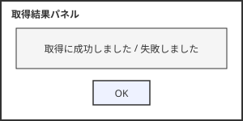

**要素**

| 要素 | 種類 | 説明 |
|---|---|---|
| メッセージ | テキスト表示 | 「取得に成功しました」または失敗内容を表示 |
| OKボタン | ボタン | パネルを閉じる |

**ふるまい**

| # | どんな時に | どんなことをしたら | どんなことをしてくれる | 対応FR |
|---|---|---|---|---|
| 1 | S02で取得処理が完了した時(成功・失敗いずれも) | (自動) | D02が結果メッセージ付きで表示される | |
| 2 | D02表示中 | 「OK」を押す | パネルを閉じ、S02(フォルダ一覧の状態)に戻る | |

### D03. 名前入力ダイアログ

**レイアウト**

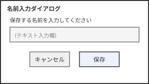

**要素**

| 要素 | 種類 | 説明 |
|---|---|---|
| テキスト入力欄 | テキスト入力 | 保存するファイル名を入力する。初期値として、選択した1枚目の画像のファイル名がプリセットされる |
| キャンセル | ボタン | 何もせずダイアログを閉じる |
| 保存 | ボタン | 入力チェックを行い、問題なければ保存する。詳細は[入出力仕様](#入出力仕様)を参照 |

**ふるまい**

| # | どんな時に | どんなことをしたら | どんなことをしてくれる | 対応FR |
|---|---|---|---|---|
| 1 | D03表示中 | 「キャンセル」を押す | ダイアログを閉じ、呼び出し元の画面に戻る(保存しない) | |
| 2 | D03表示中 | 「保存」を押す | 入力チェックを行う。問題なければ保存してD03を閉じる。問題があればD04(エラーパネル)を表示する | FR9, FR10 |

### D04. エラーパネル

**レイアウト**

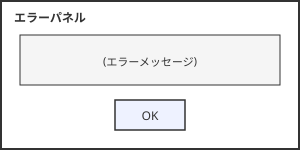

**要素**

| 要素 | 種類 | 説明 |
|---|---|---|
| メッセージ | テキスト表示 | エラー内容(空欄・禁止文字・同名重複のいずれか)を表示 |
| OKボタン | ボタン | パネルを閉じる |

**ふるまい**

| # | どんな時に | どんなことをしたら | どんなことをしてくれる | 対応FR |
|---|---|---|---|---|
| 1 | D03で入力チェックに引っかかった時 | (自動) | D04にエラーメッセージを表示する | FR10 |
| 2 | D04表示中 | 「OK」を押す | パネルを閉じ、D03(名前入力ダイアログ)に戻る | |

### D05. 保存方法選択ダイアログ

**レイアウト**

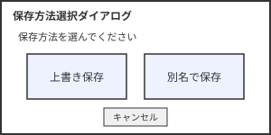

**要素**

| 要素 | 種類 | 説明 |
|---|---|---|
| 上書き保存 | ボタン | 表示中の元ファイルに、編集内容をそのまま上書き保存する |
| 別名で保存 | ボタン | D03(名前入力ダイアログ)を開き、新しい名前で保存する |
| キャンセル | ボタン | 何もせずダイアログを閉じる |

**ふるまい**

| # | どんな時に | どんなことをしたら | どんなことをしてくれる | 対応FR |
|---|---|---|---|---|
| 1 | D05表示中 | 「上書き保存」を押す | 表示中の元ファイルに編集内容を上書き保存し、D05を閉じる | |
| 2 | D05表示中 | 「別名で保存」を押す | D03(名前入力ダイアログ)が開く | |
| 3 | D05表示中 | 「キャンセル」を押す | 何もせずダイアログを閉じる | |

### D06. 接続先入力ダイアログ

**レイアウト**

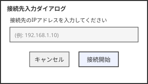

**要素**

| 要素 | 種類 | 説明 |
|---|---|---|
| IPアドレス入力欄 | テキスト入力 | 接続先のIPアドレスを入力する |
| キャンセル | ボタン | 何もせずダイアログを閉じる |
| 接続開始 | ボタン | ダイアログを閉じ、入力したIPアドレスへの接続を開始する(接続処理自体はS02に戻ってから裏で進み、S02側で状態を表示する) |

**ふるまい**

| # | どんな時に | どんなことをしたら | どんなことをしてくれる | 対応FR |
|---|---|---|---|---|
| 1 | D06表示中 | 「キャンセル」を押す | 何もせずダイアログを閉じる | |
| 2 | D06表示中 | 「接続開始」を押す | ダイアログを閉じてS02に戻り、接続状態が「接続中...」になる。裏でFTP接続とルートフォルダの一覧取得が進む | FR1 |

## 画面ごとの仕様

画面ごとに、レイアウト・要素・操作を記載する。1画面につき1セクション。

### S01. メイン画面

**レイアウト**

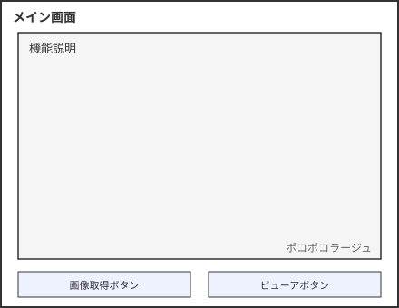

**要素**

| 要素 | 種類 | 説明 |
|---|---|---|
| 機能説明 | テキスト表示エリア | アプリの機能を説明するテキスト |
| 画像取得ボタン | ボタン | S02(画像取得画面)へ遷移する |
| ビューアボタン | ボタン | S03(ファイル一覧画面)へ遷移する |
| ポコポコラージュ | テキスト表示(右下) | アプリ名 |

**ふるまい**

| # | どんな時に | どんなことをしたら | どんなことをしてくれる | 対応FR |
|---|---|---|---|---|
| 1 | メイン画面表示中 | 「画像取得ボタン」を押す | S02(画像取得画面)に遷移する | |
| 2 | メイン画面表示中 | 「ビューアボタン」を押す | S03(ファイル一覧画面)に遷移する | |

### S02. 画像取得画面

**レイアウト**

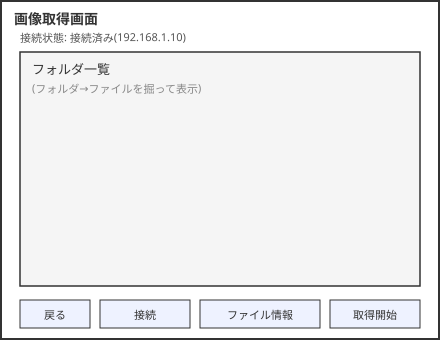

**要素**

| 要素 | 種類 | 説明 |
|---|---|---|
| 接続状態 | テキスト表示 | 「未接続」「接続中...」「接続済み(IPアドレス)」「接続失敗」のいずれかを表示 |
| フォルダ一覧 | リスト表示エリア | 接続先のフォルダ・ファイルを表示 |
| 接続 | ボタン | D06(接続先入力ダイアログ)を開く |
| ファイル情報 | テキスト表示 | 選択中のファイルの情報を表示 |
| 取得開始 | ボタン | 選択したファイルをHTTPでダウンロードする |

**ふるまい**

| # | どんな時に | どんなことをしたら | どんなことをしてくれる | 対応FR |
|---|---|---|---|---|
| 1 | 画像取得画面表示中 | 「接続」を押す | D06(接続先入力ダイアログ)が開く | |
| 2 | D06で「接続開始」を押した時 | (自動) | 接続状態が「接続中...」になる | FR1 |
| 3 | 接続処理が完了した時(成功) | (自動) | 接続状態が「接続済み(IPアドレス)」になり、フォルダ一覧に接続先のルートフォルダの中身を表示する | FR1 |
| 4 | 接続処理が完了した時(失敗) | (自動) | 接続状態が「接続失敗」になる | |
| 5 | フォルダ一覧表示中 | フォルダをタッチする | そのフォルダの中身を表示する(FTP、繰り返し掘れる) | FR2 |
| 6 | ファイルが一覧に表示されている時 | ファイルをタッチする | ファイル情報エリアに詳細を表示する | |
| 7 | ファイルを選択している時 | 「取得開始」を押す | FTPで特定したパスに対してHTTPでダウンロードし、FileXに保存する | FR3, FR4 |
| 8 | ダウンロードが成功した時 | (自動) | D02(取得結果パネル)に成功メッセージを表示する。OKを押すとS02(フォルダ一覧の状態)に戻る | FR3, FR4 |
| 9 | ダウンロードが失敗した時 | (自動) | D02(取得結果パネル)に失敗メッセージを表示する。OKを押すとS02(フォルダ一覧の状態)に戻る | |

### S03. ファイル一覧画面

**レイアウト**

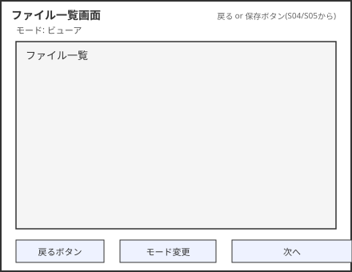

**要素**

| 要素 | 種類 | 説明 |
|---|---|---|
| モード表示 | テキスト表示 | 現在のモード(ビューア/コラージュ)を表示 |
| ファイル一覧 | リスト表示エリア | 保存済み画像の一覧(サムネイル or ファイル名) |
| 戻るボタン | ボタン | S01(メイン画面)へ戻る |
| モード変更 | ボタン | ビューア/コラージュのモードを切り替える |
| 次へ | ボタン | 選択中のモードの画面(S04またはS05)へ進む |

**ふるまい**

| # | どんな時に | どんなことをしたら | どんなことをしてくれる | 対応FR |
|---|---|---|---|---|
| 1 | ファイル一覧画面表示中 | 「戻るボタン」を押す | S01(メイン画面)に戻る | |
| 2 | ファイル一覧画面表示中 | 「モード変更」を押す | モード表示がビューア/コラージュで切り替わる | FR7 |
| 3 | ビューアモードでファイルを1枚選択している時 | 「次へ」を押す | S04(ビューア画面)に遷移し、選択した画像を表示する | FR6 |
| 4 | コラージュモードでファイルを2枚選択している時 | 「次へ」を押す | S05(コラージュ画面)に遷移し、選択した2枚を横並びで表示する | FR8 |
| 5 | S04またはS05から戻ってきた時 | (画面遷移のみ) | ファイル一覧画面が再表示される | |

### S04. ビューア画面

**レイアウト**

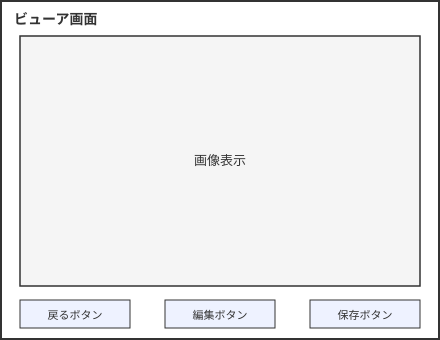

**要素**

| 要素 | 種類 | 説明 |
|---|---|---|
| 画像表示 | 画像表示エリア | 選択した画像をランタイムデコードして表示 |
| 戻るボタン | ボタン | S03(ファイル一覧画面)へ戻る |
| 編集ボタン | ボタン | D01(編集ツールバー)をミニダイアログで開く |
| 保存ボタン | ボタン | 編集内容がある時のみ有効。D05(保存方法選択ダイアログ)を開く。編集していない場合はグレーアウト(無効) |

**ふるまい**

| # | どんな時に | どんなことをしたら | どんなことをしてくれる | 対応FR |
|---|---|---|---|---|
| 1 | ビューア画面表示中 | 「戻るボタン」を押す | S03(ファイル一覧画面)に戻る | FR6 |
| 2 | ビューア画面表示中 | 「編集ボタン」を押す | D01(編集ツールバー)が開く | |
| 3 | D01で画像を移動するなど、表示中の画像に変更を加えた時 | (自動) | 「保存ボタン」がグレーアウトからハイライト(有効)に変わる | |
| 4 | 編集内容がある(保存ボタンが有効な)時 | 「保存ボタン」を押す | D05(保存方法選択ダイアログ)が開く | |
| 5 | 編集内容がない(保存ボタンがグレーアウトの)時 | 「保存ボタン」を押す | 何も起きない(無効) | |
| 6 | D05→D03経由(別名で保存)またはD05(上書き保存)で保存が成功した時 | (自動) | S05と同様、保存後もビューア画面に留まる | FR12 |

### S05. コラージュ画面

**レイアウト**

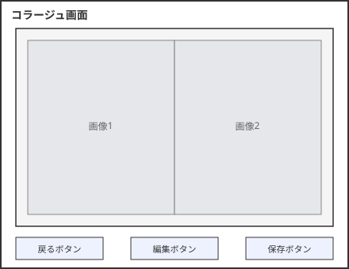

**要素**

| 要素 | 種類 | 説明 |
|---|---|---|
| 画像表示 | 画像表示エリア | 選択した2枚の画像を横並びで表示 |
| 戻るボタン | ボタン | S03(ファイル一覧画面)へ戻る |
| 編集ボタン | ボタン | D01(編集ツールバー)をミニダイアログで開く |
| 保存ボタン | ボタン | D03(名前入力ダイアログ)を開く |

**ふるまい**

| # | どんな時に | どんなことをしたら | どんなことをしてくれる | 対応FR |
|---|---|---|---|---|
| 1 | コラージュ画面表示中 | 「保存ボタン」を押す | D03(名前入力ダイアログ)が開く | FR9 |
| 2 | D03で保存が成功した時 | (自動) | 入力した名前で1枚の画像として保存する。保存後もコラージュ画面に留まる | FR9 |
| 3 | コラージュ画面表示中 | 「戻るボタン」を押す | S03(ファイル一覧画面)に戻る | |
| 4 | コラージュ画面表示中 | 「編集ボタン」を押す | D01(編集ツールバー)が開き、横並びにした画像の位置を移動できる | |

## 機能一覧(要件定義との対応)

要件定義のFRが、どの画面のどの操作で実現されるかの対応表。

| FR | 内容 | 対応する画面・操作 |
|---|---|---|
| FR1 | 指定したIPアドレスに接続し、フォルダ・ファイルを一覧表示する | S02「接続」→D06→S02 |
| FR2 | フォルダをタッチすると中身を表示し、掘って探せる | S02「フォルダ一覧」タッチ操作 |
| FR3 | FTPで特定したパスに対してHTTPでダウンロードする | S02「取得開始」 |
| FR4 | ダウンロードしたPNGを永続化する | S02「取得開始」の裏側(FileX) |
| FR5 | 保存済み画像の一覧をGUI上に表示する | S03「ファイル一覧」 |
| FR6 | 1枚タッチで画面表示する(ビューア機能) | S03→S04 |
| FR7 | 「合成」ボタンで合成モードに切り替わる | S03「モード変更」 |
| FR8 | 2枚選択で横並び表示する | S03→S05 |
| FR9 | 保存ボタンで名前を付けて保存する | S05「保存ボタン」→D03(名前入力ダイアログ) |
| FR10 | 同名ファイルはエラー表示する | D03→D04(エラーパネル) |
| FR11 | ビューアで編集ツールバーを使って画像を編集できる(今回は「移動」のみ) | S04「編集ボタン」→D01(編集ツールバー) |
| FR12 | 編集内容がある場合のみ保存ボタンが有効になり、上書き/別名保存を選べる | S04「保存ボタン」→D05(保存方法選択ダイアログ) |
| FR13 | 名前入力時の入力チェック(空欄・禁止文字・同名重複) | D03→D04(エラーパネル) |

## 入出力仕様

### D03(名前入力ダイアログ)の入力チェック

| # | チェック内容 | 条件 | 結果 |
|---|---|---|---|
| 1 | 空欄チェック | 名前が未入力のまま「保存」を押した | D04(エラーパネル)にエラーメッセージを表示する |
| 2 | 禁止文字チェック | FATファイルシステムで使えない文字(`\ / : * ? " < > \|`)が含まれている | D04(エラーパネル)にエラーメッセージを表示する |
| 3 | 重複チェック | 入力した名前が既存のファイルと同じ | D04(エラーパネル)にエラーメッセージを表示する(「同じ名前のファイルが既に存在します」) |

チェック順は 1 → 2 → 3 とし、最初に引っかかったものだけを表示する(複数同時には出さない)。
