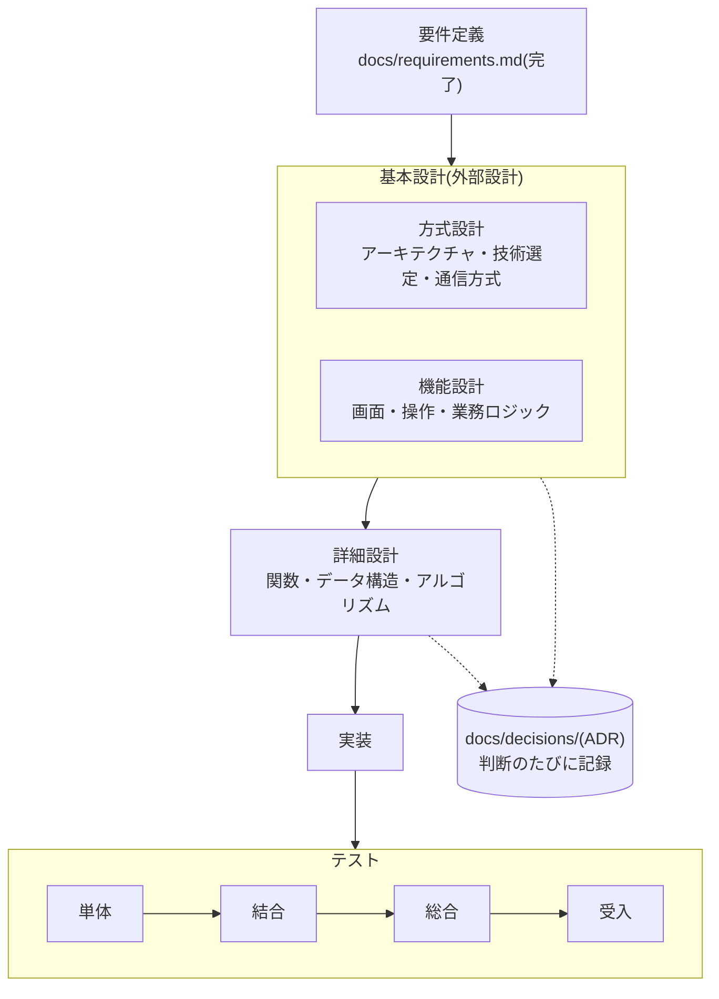

# 開発の流れ

要件定義から先の開発プロセスを示す。基本設計〜詳細設計の各工程では、[ADR](decisions/)として判断を記録していく。

```mermaid
flowchart TD
    A["要件定義<br/>docs/requirements.md(完了)"] --> B

    subgraph B["基本設計(外部設計)"]
        direction LR
        B1["方式設計<br/>アーキテクチャ・技術選定・通信方式"]
        B2["機能設計<br/>画面・操作・業務ロジック"]
    end

    B --> C["詳細設計<br/>関数・データ構造・アルゴリズム"]
    C --> D["実装"]
    D --> E

    subgraph E["テスト"]
        direction LR
        E1["単体"] --> E2["結合"] --> E3["総合"] --> E4["受入"]
    end

    ADR[("docs/decisions/(ADR)<br/>判断のたびに記録")]
    B -.-> ADR
    C -.-> ADR
```
